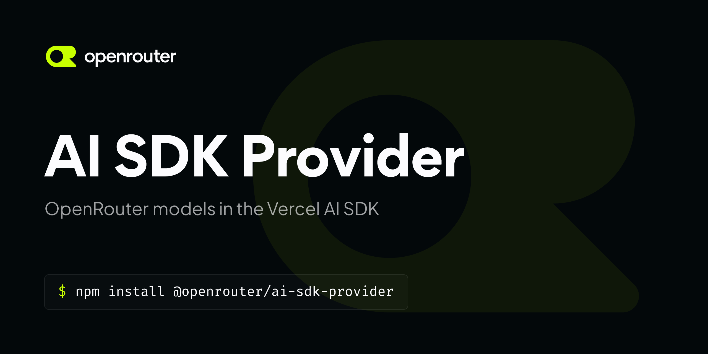

# OpenRouter Provider for Vercel AI SDK

The [OpenRouter](https://openrouter.ai/) provider for the [Vercel AI SDK](https://sdk.vercel.ai/docs) gives access to over 300 large language models on the OpenRouter chat and completion APIs.

## Setup for AI SDK v7

This release line supports `ai@^7.0.0`, requires Node.js 22 or newer, and is ESM-only.

```bash
# For pnpm
pnpm add @openrouter/ai-sdk-provider

# For npm
npm install @openrouter/ai-sdk-provider

# For yarn
yarn add @openrouter/ai-sdk-provider
```

## (LEGACY) Setup for AI SDK v6

```bash
# For pnpm
pnpm add @openrouter/ai-sdk-provider@2.9.1

# For npm
npm install @openrouter/ai-sdk-provider@2.9.1

# For yarn
yarn add @openrouter/ai-sdk-provider@2.9.1
```

## (LEGACY) Setup for AI SDK v5

```bash
# For pnpm
pnpm add @openrouter/ai-sdk-provider@1.5.4

# For npm
npm install @openrouter/ai-sdk-provider@1.5.4

# For yarn
yarn add @openrouter/ai-sdk-provider@1.5.4
```

## Provider Instance

You can import the default provider instance `openrouter` from `@openrouter/ai-sdk-provider`:

```ts
import { openrouter } from '@openrouter/ai-sdk-provider';
```

## Example

```ts
import { openrouter } from '@openrouter/ai-sdk-provider';
import { generateText } from 'ai';

const { text } = await generateText({
  model: openrouter('openai/gpt-4o'),
  prompt: 'Write a vegetarian lasagna recipe for 4 people.',
});
```

## Supported models

This list is not a definitive list of models supported by OpenRouter, as it constantly changes as we add new models (and deprecate old ones) to our system. You can find the latest list of models supported by OpenRouter [here](https://openrouter.ai/models).

You can find the latest list of tool-supported models supported by OpenRouter [here](https://openrouter.ai/models?order=newest&supported_parameters=tools). (Note: This list may contain models that are not compatible with the AI SDK.)

## Embeddings

OpenRouter supports embedding models for semantic search, RAG pipelines, and vector-native features.

### Basic Usage

```ts
import { embed } from 'ai';
import { openrouter } from '@openrouter/ai-sdk-provider';

const { embedding } = await embed({
  model: openrouter.textEmbeddingModel('openai/text-embedding-3-small'),
  value: 'sunny day at the beach',
});

console.log(embedding); // Array of numbers representing the embedding
```

### Batch Embeddings

```ts
import { embedMany } from 'ai';
import { openrouter } from '@openrouter/ai-sdk-provider';

const { embeddings } = await embedMany({
  model: openrouter.textEmbeddingModel('openai/text-embedding-3-small'),
  values: [
    'sunny day at the beach',
    'rainy day in the city',
    'snowy mountain peak',
  ],
});

console.log(embeddings); // Array of embedding arrays
```

### Supported Embedding Models

OpenRouter supports various embedding models including:
- `openai/text-embedding-3-small`
- `openai/text-embedding-3-large`
- `openai/text-embedding-ada-002`
- And more available on [OpenRouter](https://openrouter.ai/models?output_modalities=embeddings)

## Evaluation (Jev with AI SDK through OpenRouter)

`openrouter.decisionModel()` implements the AI SDK evaluation model contract on top of the [OpenRouter Decisions API](https://openrouter.ai/docs/api/api-reference/alphadecisions/submit-a-decisions-questions-and-answers-request), so `experimental_evaluate` requests go through OpenRouter instead of the AI SDK's default gateway. `openrouter.evaluationModel()` is the same method under the name the AI SDK expects; the AI SDK calls it when resolving string model IDs through a default provider, so both names share one implementation and either can be passed to `evaluate()`. `experimental_evaluate` itself ships in `ai@7.0.103` and newer; the rest of this package keeps working with any `ai@7`. The Decisions API is served from `https://openrouter.ai/api/alpha` and is still in alpha, so its request and response shapes may change ahead of the rest of the OpenRouter API.

```ts
import { openrouter } from '@openrouter/ai-sdk-provider';
import { experimental_evaluate as evaluate } from 'ai';

const result = await evaluate({
  model: openrouter.decisionModel('typesafe/jev-1.13'),
  state: {
    ticket: 'My checkout page shows a blank screen after I click Pay.',
    customer_tier: 'enterprise',
  },
  questions: {
    is_bug: {
      type: 'boolean',
      instructions: 'Is the customer reporting a software defect?',
    },
    team: {
      type: 'choice',
      instructions: 'Which team should own this ticket?',
      criteria: {
        payments: 'Checkout, billing, or payment processing issues.',
        frontend: 'Rendering, layout, or browser compatibility issues.',
        account: 'Login, permissions, or profile issues.',
      },
    },
    urgency: {
      type: 'score',
      instructions: 'How urgent is this ticket?',
      criteria: [
        'Can wait for the next release',
        'Should be fixed this week',
        'Blocking revenue right now',
      ],
    },
  },
});

result.answers.is_bug.probability; // 0.93
result.answers.team.choice; // 'payments'
result.answers.team.probabilities; // { payments: 0.87, frontend: 0.13, account: 0 }
result.answers.urgency.score; // 2 (probability-weighted mean over criteria indices)
result.answers.urgency.probabilities; // { '0': 0, '1': 0, '2': 1 }
result.providerMetadata?.openrouter; // { provider: 'TypeSafe', answers: { team: { confidence: 0.8 }, ... }, usage: { cost: 0.000018228 } }
```

Question types map as follows: AI SDK `boolean` becomes an OpenRouter `noul` question and the returned `noul` value is exposed as `probability`, while `choice` and `score` map directly and keep their probability distributions. The Decisions API rounds probabilities and scores to two decimals, and the model declares that rounding on every result so the AI SDK accepts scores that differ from the exact probability-weighted mean by rounding alone. Per-answer `confidence` and score `legend` values that have no field in the AI SDK contract are preserved under `result.providerMetadata.openrouter.answers[questionId]`, and the request `cost` is under `result.providerMetadata.openrouter.usage.cost`.

The Decisions API rejects a `score` question whose `criteria` contains `null` and a `boolean` question whose `criteria` describes only one of `true` and `false`, so the model throws an `InvalidArgumentError` for those inputs before sending anything (and before anything is billed). A `boolean` question with no criteria descriptions at all is sent without `criteria`.

Model settings accept `user`, `provider` (routing preferences), `session_id`, `trace`, and `extraBody`; call-level `providerOptions.openrouter` accepts the same Decisions request fields plus arbitrary pass-through keys. Precedence, lowest to highest, is factory `extraBody`, model `extraBody`, typed model settings, then `providerOptions.openrouter`; `model`, `state`, and `questions` always come from the call and cannot be overridden.

When `baseURL` is customized, the Decisions URL is derived by replacing a trailing `/v1` with `/alpha` (`https://proxy.example.com/api/v1` becomes `https://proxy.example.com/api/alpha`). If your `baseURL` does not end in `/v1`, set `decisionsBaseURL` explicitly; `decisionModel()` throws a `LoadSettingError` otherwise:

```ts
const openrouter = createOpenRouter({
  baseURL: 'https://proxy.example.com/openrouter',
  decisionsBaseURL: 'https://proxy.example.com/openrouter-alpha',
});
```

## Reasoning Effort

Set `reasoning.effort` in the model settings to request a reasoning effort supported by your model:

```typescript
import { createOpenRouter } from '@openrouter/ai-sdk-provider';

const openrouter = createOpenRouter({ apiKey: 'your-api-key' });
const model = openrouter.chat('openai/gpt-6-luna', {
  reasoning: { effort: 'max' },
});
```

Accepted values are `max`, `xhigh`, `high`, `medium`, `low`, `minimal`, and `none`. Support varies by model; see [OpenRouter's reasoning documentation](https://openrouter.ai/docs/guides/best-practices/reasoning-tokens). You can also set `reasoning.effort` per call using `providerOptions.openrouter`.

## Passing Extra Body to OpenRouter

There are 3 ways to pass extra body to OpenRouter:

1. Via the `providerOptions.openrouter` property:

   ```typescript
   import { createOpenRouter } from '@openrouter/ai-sdk-provider';
   import { streamText } from 'ai';

   const openrouter = createOpenRouter({ apiKey: 'your-api-key' });
   const model = openrouter('anthropic/claude-3.7-sonnet:thinking');
   await streamText({
     model,
     messages: [{ role: 'user', content: 'Hello' }],
     providerOptions: {
       openrouter: {
         reasoning: {
           max_tokens: 10,
         },
       },
     },
   });
   ```

2. Via the `extraBody` property in the model settings:

   ```typescript
   import { createOpenRouter } from '@openrouter/ai-sdk-provider';
   import { streamText } from 'ai';

   const openrouter = createOpenRouter({ apiKey: 'your-api-key' });
   const model = openrouter('anthropic/claude-3.7-sonnet:thinking', {
     extraBody: {
       reasoning: {
         max_tokens: 10,
       },
     },
   });
   await streamText({
     model,
     messages: [{ role: 'user', content: 'Hello' }],
   });
   ```

3. Via the `extraBody` property in the model factory.

   ```typescript
   import { createOpenRouter } from '@openrouter/ai-sdk-provider';
   import { streamText } from 'ai';

   const openrouter = createOpenRouter({
     apiKey: 'your-api-key',
     extraBody: {
       reasoning: {
         max_tokens: 10,
       },
     },
   });
   const model = openrouter('anthropic/claude-3.7-sonnet:thinking');
   await streamText({
     model,
     messages: [{ role: 'user', content: 'Hello' }],
   });
   ```

## Anthropic Prompt Caching

You can include Anthropic-specific options directly in your messages when using functions like `streamText`. The OpenRouter provider will automatically convert these messages to the correct format internally.

### Basic Usage

```typescript
import { createOpenRouter } from '@openrouter/ai-sdk-provider';
import { streamText } from 'ai';

const openrouter = createOpenRouter({ apiKey: 'your-api-key' });
const model = openrouter('anthropic/<supported-caching-model>');

await streamText({
  model,
  messages: [
    {
      role: 'system',
      content:
        'You are a podcast summary assistant. You are detail-oriented and critical about the content.',
    },
    {
      role: 'user',
      content: [
        {
          type: 'text',
          text: 'Given the text body below:',
        },
        {
          type: 'text',
          text: `<LARGE BODY OF TEXT>`,
          providerOptions: {
            openrouter: {
              cacheControl: { type: 'ephemeral' },
            },
          },
        },
        {
          type: 'text',
          text: 'List the speakers?',
        },
      ],
    },
  ],
});
```

## Anthropic Beta Features

You can enable Anthropic beta features by passing custom headers through the OpenRouter SDK.

### Fine-grained Tool Streaming

[Fine-grained tool streaming](https://docs.anthropic.com/en/docs/agents-and-tools/tool-use/fine-grained-tool-streaming) allows streaming tool parameters without buffering, reducing latency for large schemas. This is particularly useful when working with large nested JSON structures.

**Important:** This is a beta feature from Anthropic. Make sure to evaluate responses before using in production.

#### Basic Usage

```typescript
import { createOpenRouter } from '@openrouter/ai-sdk-provider';
import { streamObject } from 'ai';

const provider = createOpenRouter({
  apiKey: process.env.OPENROUTER_API_KEY,
  headers: {
    'anthropic-beta': 'fine-grained-tool-streaming-2025-05-14',
  },
});

const model = provider.chat('anthropic/claude-sonnet-4');

const result = await streamObject({
  model,
  schema: yourLargeSchema,
  prompt: 'Generate a complex object...',
});

for await (const partialObject of result.partialObjectStream) {
  console.log(partialObject);
}
```

You can also pass the header at the request level:

```typescript
import { createOpenRouter } from '@openrouter/ai-sdk-provider';
import { generateText } from 'ai';

const provider = createOpenRouter({
  apiKey: process.env.OPENROUTER_API_KEY,
});

const model = provider.chat('anthropic/claude-sonnet-4');

await generateText({
  model,
  prompt: 'Hello',
  headers: {
    'anthropic-beta': 'fine-grained-tool-streaming-2025-05-14',
  },
});
```

**Note:** Fine-grained tool streaming is specific to Anthropic models. When using models from other providers, the header will be ignored.

#### Use Case: Large Component Generation

This feature is particularly beneficial when streaming large, nested JSON structures like UI component trees:

```typescript
import { createOpenRouter } from '@openrouter/ai-sdk-provider';
import { streamObject } from 'ai';
import { z } from 'zod';

const componentSchema = z.object({
  type: z.string(),
  props: z.record(z.any()),
  children: z.array(z.lazy(() => componentSchema)).optional(),
});

const provider = createOpenRouter({
  apiKey: process.env.OPENROUTER_API_KEY,
  headers: {
    'anthropic-beta': 'fine-grained-tool-streaming-2025-05-14',
  },
});

const model = provider.chat('anthropic/claude-sonnet-4');

const result = await streamObject({
  model,
  schema: componentSchema,
  prompt: 'Create a responsive dashboard layout',
});

for await (const partialComponent of result.partialObjectStream) {
  console.log('Partial component:', partialComponent);
}
```

## Use Cases

### Response Healing for Structured Outputs

The provider supports the [Response Healing plugin](https://openrouter.ai/docs/guides/features/plugins/response-healing), which automatically validates and repairs malformed JSON responses from AI models. This is particularly useful when using `generateObject` or structured outputs, as it can fix common issues like missing brackets, trailing commas, markdown wrappers, and mixed text.

```typescript
import { createOpenRouter } from '@openrouter/ai-sdk-provider';
import { generateObject } from 'ai';
import { z } from 'zod';

const openrouter = createOpenRouter({ apiKey: 'your-api-key' });
const model = openrouter('openai/gpt-4o', {
  plugins: [{ id: 'response-healing' }],
});

const { object } = await generateObject({
  model,
  schema: z.object({
    name: z.string(),
    age: z.number(),
  }),
  prompt: 'Generate a person with name and age.',
});

console.log(object); // { name: "John", age: 30 }
```

Note that Response Healing only works with non-streaming requests. When the model returns imperfect JSON formatting, the plugin attempts to repair the response so you receive valid, parseable JSON.

### Debugging API Requests

The provider supports a debug mode that echoes back the request body sent to the upstream provider. This is useful for troubleshooting and understanding how your requests are being processed. Note that debug mode only works with streaming requests.

```typescript
import { createOpenRouter } from '@openrouter/ai-sdk-provider';
import { streamText } from 'ai';

const openrouter = createOpenRouter({ apiKey: 'your-api-key' });
const model = openrouter('anthropic/claude-3.5-sonnet', {
  debug: {
    echo_upstream_body: true,
  },
});

const result = await streamText({
  model,
  prompt: 'Hello, how are you?',
});

// The debug data is available in the stream's first chunk
// and in the final response's providerMetadata
for await (const chunk of result.fullStream) {
  // Debug chunks have empty choices and contain debug.echo_upstream_body
  console.log(chunk);
}
```

The debug response will include the request body that was sent to the upstream provider, with sensitive data redacted (user IDs, base64 content, etc.). This helps you understand how OpenRouter transforms your request before sending it to the model provider.

### Usage Accounting

The provider supports [OpenRouter usage accounting](https://openrouter.ai/docs/use-cases/usage-accounting), which allows you to track token usage details directly in your API responses, without making additional API calls.

```typescript
// Enable usage accounting
const model = openrouter('openai/gpt-3.5-turbo', {
  usage: {
    include: true,
  },
});

// Access usage accounting data
const result = await generateText({
  model,
  prompt: 'Hello, how are you today?',
});

// AI SDK v7 standard usage details
console.log('Input tokens:', result.usage.inputTokens);
console.log('Cached input tokens:', result.usage.inputTokenDetails.cacheReadTokens);
console.log('Reasoning tokens:', result.usage.outputTokenDetails.reasoningTokens);

// Provider-specific usage details (available in providerMetadata)
if (result.providerMetadata?.openrouter?.usage) {
  console.log('Cost:', result.providerMetadata.openrouter.usage.cost);
  console.log(
    'Total Tokens:',
    result.providerMetadata.openrouter.usage.totalTokens,
  );
}
```

It also supports BYOK (Bring Your Own Key) [usage accounting](https://openrouter.ai/docs/docs/guides/usage-accounting#cost-breakdown), which allows you to track passthrough costs when you are using a provider's own API key in your OpenRouter account.

```typescript
// Assuming you have set an OpenAI API key in https://openrouter.ai/settings/integrations

// Enable usage accounting
const model = openrouter('openai/gpt-3.5-turbo', {
  usage: {
    include: true,
  },
});

// Access usage accounting data
const result = await generateText({
  model,
  prompt: 'Hello, how are you today?',
});

console.log('Input tokens:', result.usage.inputTokens);
console.log('Cached input tokens:', result.usage.inputTokenDetails.cacheReadTokens);
console.log('Reasoning tokens:', result.usage.outputTokenDetails.reasoningTokens);

// Provider-specific BYOK usage details (available in providerMetadata)
if (result.providerMetadata?.openrouter?.usage) {
  const costDetails = result.providerMetadata.openrouter.usage.costDetails;
  if (costDetails) {
    console.log('BYOK cost:', costDetails.upstreamInferenceCost);
  }
  console.log('OpenRouter credits cost:', result.providerMetadata.openrouter.usage.cost);
  console.log(
    'Total Tokens:',
    result.providerMetadata.openrouter.usage.totalTokens,
  );
}
```
